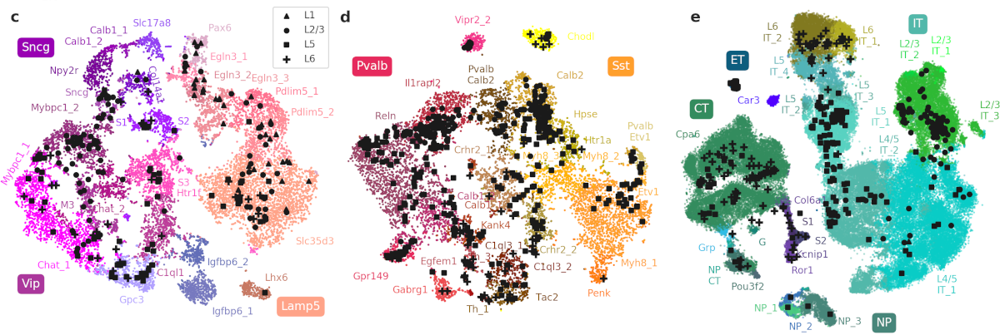

# Phenotypic variation of transcriptomic cell types in mouse motor cortex

https://www.biorxiv.org/content/10.1101/2020.02.03.929158v1

This repository contains the analysis code and the preprocessed data for the above manuscript. 

------------

## Preprocessed data and meta data

All meta data and preprocessed data are located in the `data/` folder. This includes exonic and intronic gene counts, extracted electrophysiological features, extracted morphological features and z-profiles. There are two separate datasets: the main dataset recorded at room temperature and the follow-up dataset recorded at physiological temperature (files with `phys_temp` in the filenames).

## Downloading the raw data

* Raw morphological reconstructions in SWC format can be downloaded from [ftp://download.brainimagelibrary.org:8811/3a/88/3a88a7687ab66069/](https://bit.ly/2VIvP3Z). Download three folders (`excitatory`, `inhibitory`, and `vip_dendrites_only`) and put them into `data/raw/morph/`. These files are needed to create figures that show morphological reconstructions. Extracted morphological features are provided in this repository (see above).

* Raw electrophysiological traces in NWB format can be downloaded from https://dandiarchive.org/dandiset/000008/ and https://dandiarchive.org/dandiset/000035 (physiological temperature experiments). Download all folders (using `dandi` command line tool as described [here](https://github.com/dandi/dandiarchive/issues/385#issuecomment-639803133) and put them into `data/raw/ephys/` and `data/raw/ephys_phys/` respectively. These files are needed to create figures that illustrate the extraction procedure of electrophysiological features, and to create figures that show electrophysiological traces. Extracted electrophysiological features of all cells are provided in `data/` as. 

* Raw transcriptomic data in FASTQ format can be downloaded from http://data.nemoarchive.org/biccn/grant/zeng/tolias/. We describe in `data/zumis/` how we converted the FASTQ files into the count tables.

## Python notebooks to reproduce our analysis and figures

1. Run `preprocess-morph-SWC-files.ipynb` to preprocess (resample, smooth, etc.) the raw SWC files with reconstructed morphologies. Resulting SWC files are saved in a separate folder.
1. Run `extract-morphometric-features.ipynb` to extract the morphometric features using the preprocessed SWC files. The resulting CSV tables are provided in this repository.
2. Run `preprocess-ephys-files.ipynb` to extract the electrophysiological features. The resulting CSV tables are provided in this repository. This script also creates one supplementary figure illustrating the extraction process (and creates similar figures for all cells).
3. Run `allen-data-preprocess.ipynb` to preprocess the Allen Institute data: select variable genes, run t-SNEs, etc. The results are saved as .pickle files.
4. Run `patch-seq-data-load.ipynb` to load all our data and package together into a convenient Python object. The result is saved as a .pickle file.
5. Run `ttype-assignment.ipynb` to assign all cells to the t-types. The result is saved as a .pickle file. This notebook also produces several supplementary figures.
6. The remaining notebooks load the .pickle files and produce individual figures. They can be run in any order.
